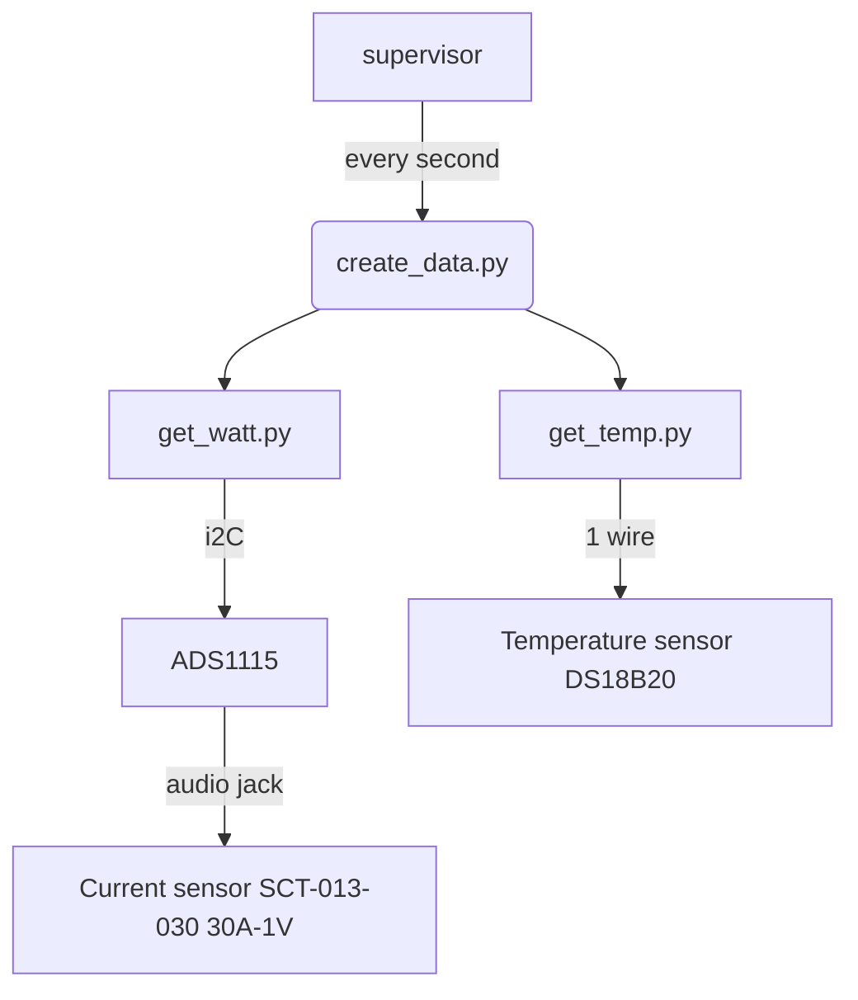

# Architecture du programme

## Base de données

| Table | Contenu | 
| ---- | ----- |
| Chaudiere | 1 entrée à chaque appel du script sensor/create_data.py (toutes les 3 à 5 secondes)|
|ChaudiereMinute|1 entrée par minute (moyenne des données de la table Chaudiere)|

Pour simplifier le code, les deux tables ont la même structure et les mêmes champs. Le champ `phase` n’est pas utilisé dans la table `Chaudiere`.

## Principes de base
### create_data.py
Le script `sensor/create_data.py` tourne en tâche de fond géré par `supervisor`. Il récupère les données des capteur (températures et moteurs) et les enregistre dans la table `Chaudiere` toutes les 3 à 5 secondes environ.

### archive_minute.py
Le script `flask_app/script/archive_minute.py` est appelé toutes les deux minutes (`cron`).

Si de nouvelles données sont présentent dans la table `Chaudiere`, alors il crée une/plusieurs entrées dans la table `ChaudiereMinute` (une entrée pour chaque minute).

La valeur température est la moyenne des températures (sur une minute) de la table `Chaudiere`.

La valeur des moteur est un booléen qui vaut true si au moins une entrée (sur une minute) est vraie.

En mode production, deux minutes sont traitées à chaque appel

### process_phase.py
Le script `flask_app/script/process_phase.py` est appelé toutes les deux minutes (cron). Si de nouvelles entrées sont à traiter dans la table `ChaudiereMinute` alors il exécute un algorithme pour déterminer la phase de fonctionnement de la chaudière au cours de chaque minute qu’il traite.

En mode production, deux minutes sont traitées à chaque appel

Si la température de l’eau de la chaudiere (temp0) passe sous la consigne, alors une alerte mail/sms est générée. Aucun mail/sms n’est envoyé si une alerte à déja été générée dans les 10 minutes précédentes.

## getting sensor data

<!--stackedit_data:
eyJoaXN0b3J5IjpbMTMzMzgwMjYzNSwtMzI2OTg0ODAzLDEyNz
Q2NTIwMDksLTE3NDQ3MDIxNDAsNDk4MjI0NiwtMTQ3NTI3NzU2
OV19
-->